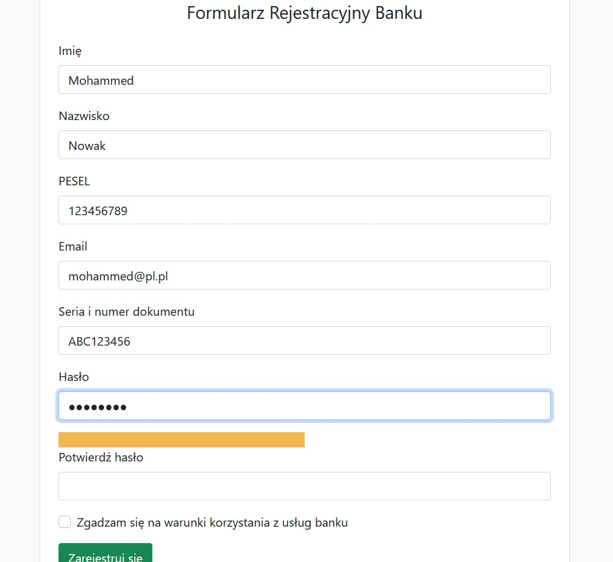
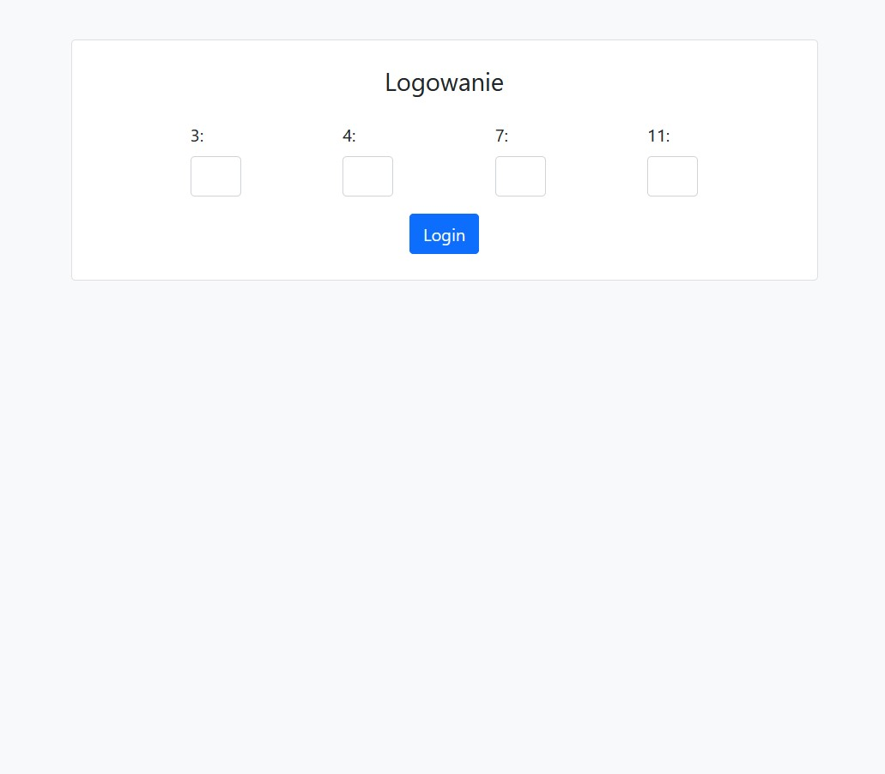
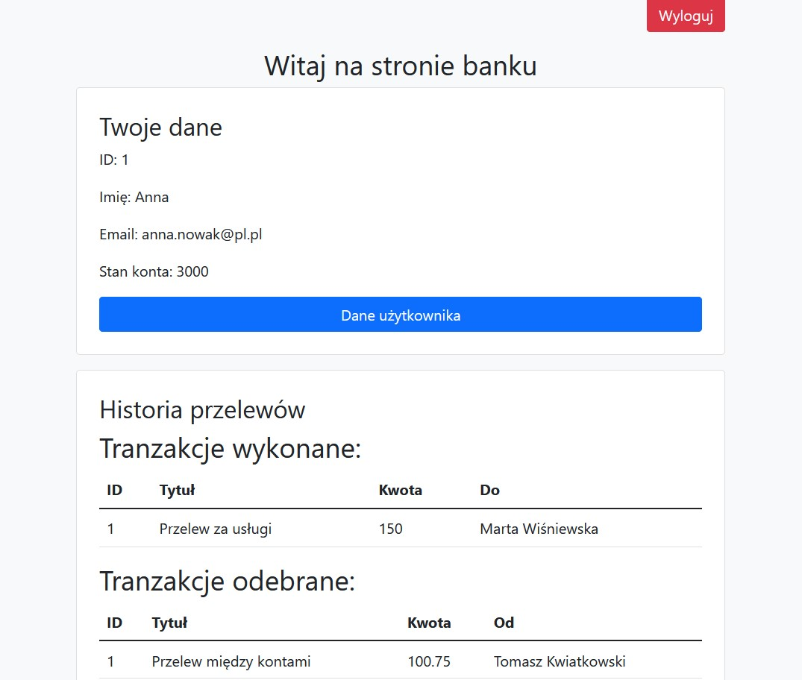
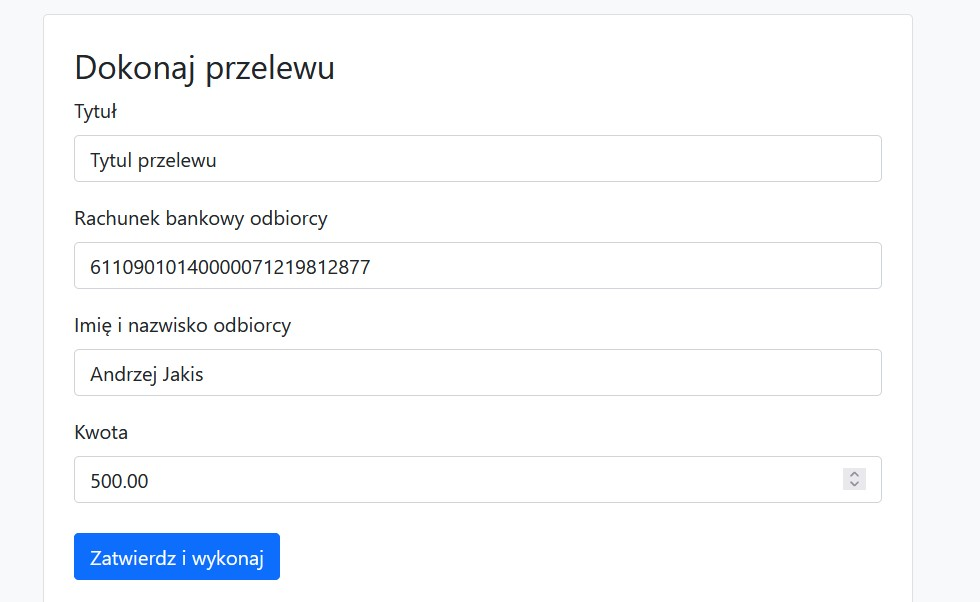
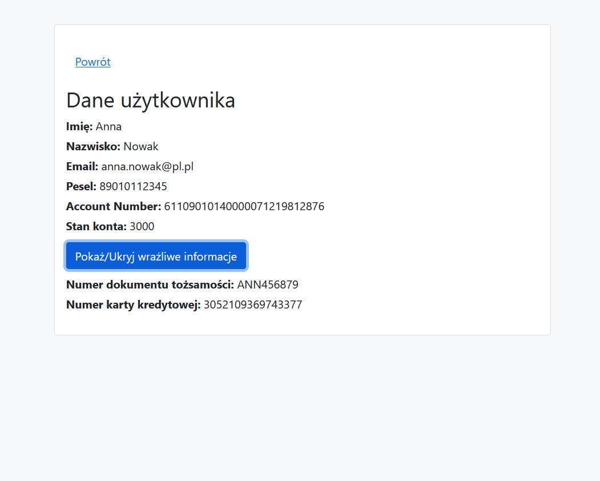

# Simple Bank Application

## Overview
This project is a minimalistic web-based banking application built using Flask (Python). It focuses primarily on security aspects rather than aesthetic design. The application features encrypted connections with a self-signed certificate managed by nginx and runs in Docker container.

## Features
- **Password Handling**: Utilizes a non-traditional method for password input where users are required to enter specific characters of their password. Passwords are managed using Shamir's Secret Sharing algorithm.
- **Enhanced Authentication**: Includes a delay on repeated login attempts and a lockout mechanism after several failed login attempts to prevent brute force attacks.
- **Data Encryption**: Sensitive user data is encrypted using AES CBC mode to ensure data privacy and security.
- **XSS and XSRF Protections**: Implements mechanisms to safeguard against cross-site scripting and cross-site request forgery.
- **User Registration and Login**: Secure signup and login processes.
- **Transfers**: Allows users to send money transfers to other registered users within the platform.
- **Nginx**: Utilizes Nginx as a reverse proxy to manage SSL/TLS for secure, encrypted communications. The use of a self-signed certificate ensures that data transmitted between the client and server is secure.
- **Docker**: The application is dockerized

## Screenshots

|                                     |                                       |
|-------------------------------------|---------------------------------------|
|   |        |
|    |  |
|  |

## Running the Application
The application runnable with Docker.

1. Clone the repository.
2. Run `docker-compose up` from the root of the project directory to start the application or start manually (you need to init database with sqlite3 and start app using python, see requirements.txt)
